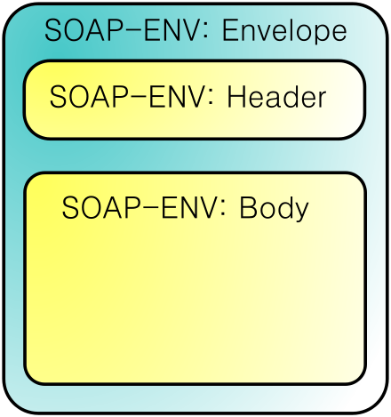

# :shower: SOAP et WSDL en Java

## Introduction

SOAP est un protocole de Webservice qui est aujourd'hui bien moins utilisé qu'il y a une dizaine d'année.
Cependant, beaucoup de service web fournissent encore des API SOAP (notamment des services institutionnels).
Il est donc intéressant qu'on puisse voir ce protocole dans un usage simplifié.

## Quésako

SOAP pour Simple Object Access Protocol est basé sur le format XML.
Le schéma d'échange de donnée est décrit fortement.

Un WS SOAP possède une structure d'échanges basée sur:



Exemple ici:

```xml{2,6-8}
<?xml version="1.0"?>
<soap:Envelope xmlns:soap="http://www.w3.org/2003/05/soap-envelope" xmlns:m="http://www.example.org">
  <soap:Header>
  </soap:Header>
  <soap:Body>
    <m:GetStockPrice>
      <m:StockName>GOOG</m:StockName>
    </m:GetStockPrice>
  </soap:Body>
</soap:Envelope>
```

On remarque que ce fichier suit la XSD définie sur [https://www.w3.org/2003/05/soap-envelope/](https://www.w3.org/2003/05/soap-envelope/)
Mais également un `namespace` nommé `m` sur laquelle est définie le noeud `GetStockPrice`.

## Mais d'où ça sort ?

Alors, c'est un successeur de XML-rpc qui possède l'avantage de normaliser les réponses.
Autant, sur XML-rpc ou JSON-rpc, les "query" ont une structure stricte, autant la réponse, elle, est vraiment très libre.

Il est donc assez compliqué de construire le client de WS sans créer un couplage très fort (sans pouvoir se baser sur une configuration dynamique).

Pour simplifier la consommation de ces WS, à la même époque est apparu le concept de _WSDL_.

## Les WSDL

Les Web Services Description Language est basé sur une structure XML pour décrire les méthodes apportées par un WS.
Tout peut y être décrit:

- les procédures distantes disponibles
  - leur réponse
  - leur paramètres
- les endpoints

```xml
<?xml version="1.0"?>
<definitions name = "HelloService"
   targetNamespace = "http://www.examples.com/wsdl/HelloService.wsdl"
   xmlns = "http://schemas.xmlsoap.org/wsdl/"
   xmlns:soap = "http://schemas.xmlsoap.org/wsdl/soap/"
   xmlns:tns = "http://www.examples.com/wsdl/HelloService.wsdl"
   xmlns:xsd = "http://www.w3.org/2001/XMLSchema">

   <message name = "SayHelloRequest">
      <part name = "firstName" type = "xsd:string"/>
   </message>

   <message name = "SayHelloResponse">
      <part name = "greeting" type = "xsd:string"/>
   </message>

   <portType name = "Hello_PortType">
      <operation name = "sayHello">
         <input message = "tns:SayHelloRequest"/>
         <output message = "tns:SayHelloResponse"/>
      </operation>
   </portType>

   <binding name = "Hello_Binding" type = "tns:Hello_PortType">
      <soap:binding style = "rpc"
         transport = "http://schemas.xmlsoap.org/soap/http"/>
      <operation name = "sayHello">
         <soap:operation soapAction = "sayHello"/>
         <input>
            <soap:body
               encodingStyle = "http://schemas.xmlsoap.org/soap/encoding/"
               namespace = "urn:examples:helloservice"
               use = "encoded"/>
         </input>

         <output>
            <soap:body
               encodingStyle = "http://schemas.xmlsoap.org/soap/encoding/"
               namespace = "urn:examples:helloservice"
               use = "encoded"/>
         </output>
      </operation>
   </binding>

   <service name = "Hello_Service">
      <documentation>WSDL File for HelloService</documentation>
      <port binding = "tns:Hello_Binding" name = "Hello_Port">
         <soap:address
            location = "http://www.examples.com/SayHello/" />
      </port>
   </service>
</definitions>
```

## Votre premier service SOAP avec WSDL grâce à Spring

Dans le dossier [../workshops/soap](../workshops/soap) est défini un server de WS SOAP en Java Spring.

Voici le WSDL a générer grâce à Spring

```xml

<?xml version="1.0" encoding="UTF-8" standalone="no"?><wsdl:definitions xmlns:wsdl="http://schemas.xmlsoap.org/wsdl/" xmlns:sch="http://spring.io/guides/gs-producing-web-service" xmlns:soap="http://schemas.xmlsoap.org/wsdl/soap/" xmlns:tns="http://spring.io/guides/gs-producing-web-service" targetNamespace="http://spring.io/guides/gs-producing-web-service">
  <wsdl:types>
    <xs:schema xmlns:xs="http://www.w3.org/2001/XMLSchema" elementFormDefault="qualified" targetNamespace="http://spring.io/guides/gs-producing-web-service">

    <xs:element name="getBookRequest">
        <xs:complexType>
            <xs:sequence>
                <xs:element name="id" type="xs:int"/>
            </xs:sequence>
        </xs:complexType>
    </xs:element>

    <xs:element name="getBookResponse">
        <xs:complexType>
            <xs:sequence>
                <xs:element name="book" type="tns:book"/>
            </xs:sequence>
        </xs:complexType>
    </xs:element>

    <xs:complexType name="book">
        <xs:sequence>
            <xs:element name="id" type="xs:int"/>
            <xs:element name="name" type="xs:string"/>
            <xs:element name="numberOfPages" type="xs:int"/>
            <xs:element name="publisher" type="xs:string"/>
        </xs:sequence>
    </xs:complexType>
</xs:schema>
  </wsdl:types>
  <wsdl:message name="getBookRequest">
    <wsdl:part element="tns:getBookRequest" name="getBookRequest">
    </wsdl:part>
  </wsdl:message>
  <wsdl:message name="getBookResponse">
    <wsdl:part element="tns:getBookResponse" name="getBookResponse">
    </wsdl:part>
  </wsdl:message>
  <wsdl:portType name="2345">
    <wsdl:operation name="getBook">
      <wsdl:input message="tns:getBookRequest" name="getBookRequest">
    </wsdl:input>
      <wsdl:output message="tns:getBookResponse" name="getBookResponse">
    </wsdl:output>
    </wsdl:operation>
  </wsdl:portType>
  <wsdl:binding name="2345Soap11" type="tns:2345">
    <soap:binding style="document" transport="http://schemas.xmlsoap.org/soap/http"/>
    <wsdl:operation name="getBook">
      <soap:operation soapAction=""/>
      <wsdl:input name="getBookRequest">
        <soap:body use="literal"/>
      </wsdl:input>
      <wsdl:output name="getBookResponse">
        <soap:body use="literal"/>
      </wsdl:output>
    </wsdl:operation>
  </wsdl:binding>
  <wsdl:service name="2345Service">
    <wsdl:port binding="tns:2345Soap11" name="2345Soap11">
      <soap:address location="http://localhost:8080/ws"/>
    </wsdl:port>
  </wsdl:service>
</wsdl:definitions>
```

A faire:

- Lire la doc de spring relative au WS SOAP [https://spring.io/guides/gs/producing-web-service/](https://spring.io/guides/gs/producing-web-service/)
- Faire fonctionner le endpoint spring getBooks
- Faire valider au prof
- Générer le client SOAP grâce au WSDL
- Faire valider au prof
- Ajouter une fonction `getBooks` qui permet de récupérer l'ensemble des livres de Got
- Faire valider au prof
- Générer un client automatiquement grâce au WSDL.

## Pour tester votre webservice

GetBook

```sh
curl --header "content-type: text/xml" -d @request.xml http://localhost:8080/ws
```

GetBooks

```sh
curl --header "content-type: text/xml" -d @multiRequest.xml http://localhost:8080/ws
```

## (Optionnel) Déploiement du service dans le cloud

Si vous avez terminé de développer votre server, essayer de le déployer sur un provider cloud comme [Clever Cloud](https://www.clever-cloud.com/en/)

## Les points clés

:::tip

- :white_check_mark: HTTP, UDP, TCP, JMS
- :x: Petits messages
- :white_check_mark: Gestion d'erreurs avec code
- XML
- Statefull
- Souvent Monolithique
- Multi request
- :x: Support des notification (pas de réponse)
- :white_check_mark: Schéma d'API fort
- :white_check_mark: Format de message fort
  :::
